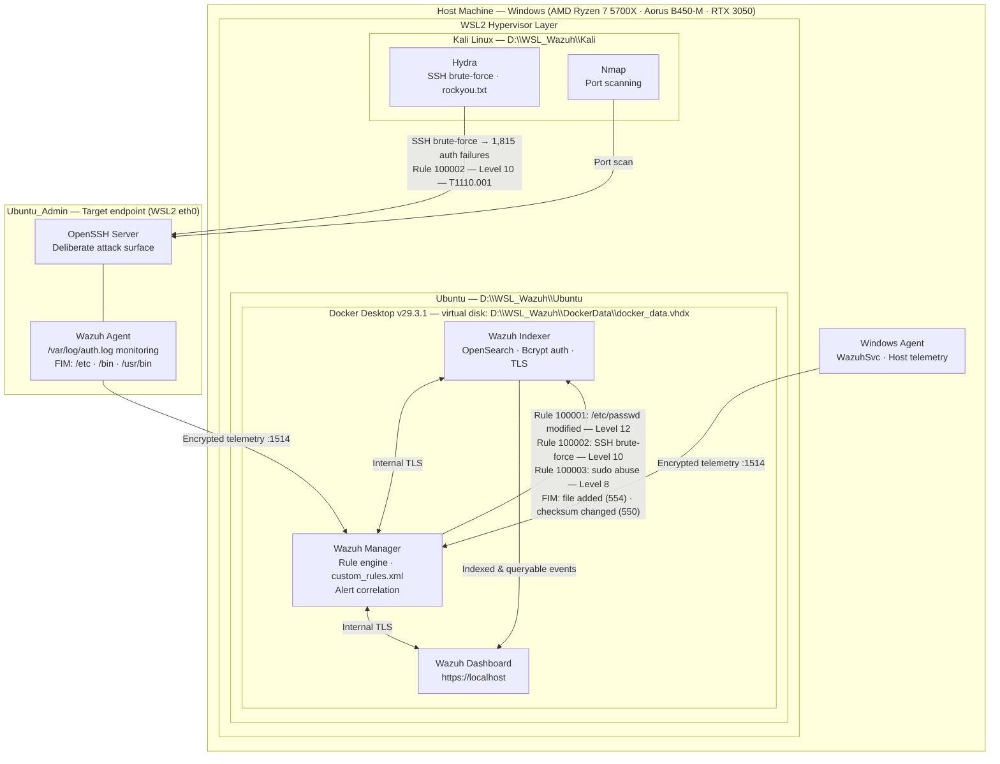

# Lab architecture

> Complete infrastructure diagram reflecting the final storage configuration after full migration of all components to the secondary SSD (D: drive).

---

## Architecture diagram

---

## Storage layout

All components successfully migrated to the secondary SSD (D: drive).

| Component | Location | Notes |
|---|---|---|
| Ubuntu WSL2 distro | `D:\WSL_Wazuh\Ubuntu` | Migrated via WSL export/import |
| Kali Linux WSL2 distro | `D:\WSL_Wazuh\Kali` | Migrated via WSL export/import |
| Docker virtual disk | `D:\WSL_Wazuh\DockerData\docker_data.vhdx` | Relocated via Docker Desktop Settings → Resources → Advanced |
| Docker Desktop engine | C: (WSL2 backend binaries) | Binaries remain on C: by design |

> **Note on Docker migration:** The initial attempt to migrate Docker via WSL `export/import` of the `docker-desktop` distribution was partially successful at the WSL layer, but container payload remained on C:. The complete solution was discovered in Docker Desktop's native UI under **Settings → Resources → Advanced (or Virtual Disk) → Disk image location**, which handles the `docker_data.vhdx` relocation natively without PowerShell workarounds.

---

## Detection coverage

| Rule ID | Threat vector | Level | Parent SID | ATT&CK technique |
|---|---|---|---|---|
| 100001 | `/etc/passwd` modification (FIM) | 12 | 550 | T1078 — Valid accounts |
| 100002 | SSH brute-force (5+ attempts / 60s, same IP) | 10 | 5760 | T1110.001 — Password guessing |
| 100003 | Multiple failed `sudo` attempts | 8 | 5404 | T1548.003 — Sudo and sudo caching |
| 554 *(built-in)* | File added to monitored directory | 5 | — | T1565 — Data manipulation |
| 550 *(built-in)* | File integrity checksum changed | 7 | — | T1565 — Data manipulation |

---

## Stack versions

| Component | Version | Location |
|---|---|---|
| Wazuh Manager | 4.14.4 | Docker container |
| Wazuh Indexer | 4.14.4 | Docker container · OpenSearch |
| Wazuh Dashboard | 4.14.4 | Docker container · `https://localhost` |
| Docker Desktop | 29.3.1 | WSL2 backend |
| Ubuntu (WSL2) | Latest LTS | `D:\WSL_Wazuh\Ubuntu` |
| Kali Linux (WSL2) | Rolling | `D:\WSL_Wazuh\Kali` |

---

*Part of the [Wazuh SIEM Home Lab](../README.md) project.*
