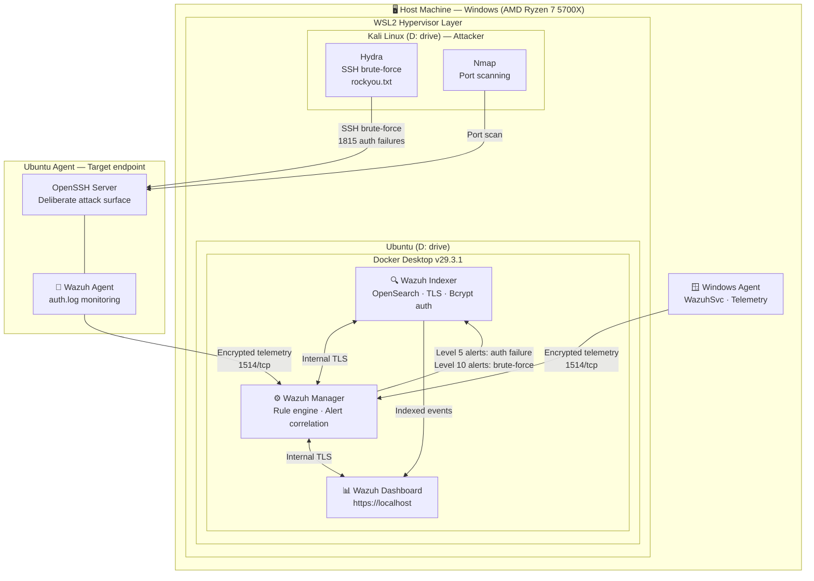

# Wazuh SIEM Home Lab — Architecture



## Detection coverage

| Attack simulated       | Tool   | Wazuh rule level | ATT&CK technique             |
|------------------------|--------|------------------|------------------------------|
| SSH brute-force        | Hydra  | Level 10         | T1110.001 — Password Guessing |
| Auth failure (single)  | Hydra  | Level 5          | T1110 — Brute Force           |
| Network reconnaissance | Nmap   | Level 5          | T1046 — Network Service Scan  |
| File integrity change  | Manual | Level 7          | T1565 — Data Manipulation     |

## Stack versions

| Component        | Version      | Notes                        |
|------------------|--------------|------------------------------|
| Wazuh Manager    | 4.14.4       | Single-node Docker           |
| Wazuh Indexer    | 4.14.4       | OpenSearch + Bcrypt auth     |
| Wazuh Dashboard  | 4.14.4       | Self-signed TLS              |
| Docker Desktop   | 29.3.1       | WSL2 backend                 |
| Ubuntu (WSL2)    | Latest LTS   | Migrated to D: drive         |
| Kali Linux (WSL2)| Rolling      | Migrated to D: drive         |
```
